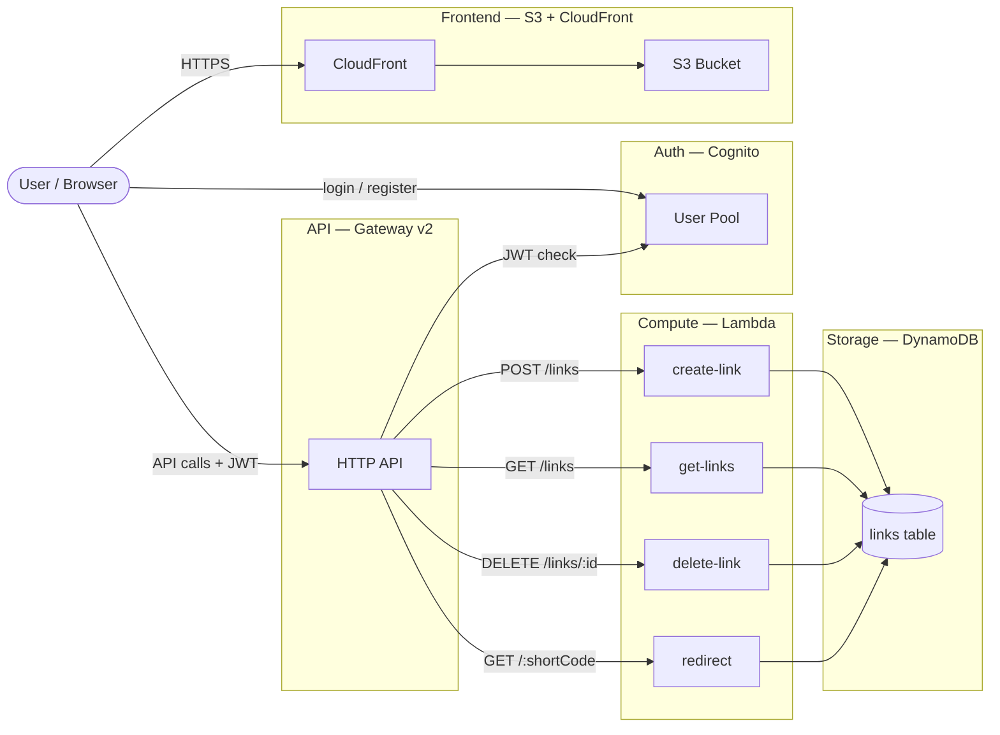

# LinkShort — Serverless URL Shortener on AWS

A full-stack serverless URL shortener built on AWS. Users can create short links, track click counts, and manage their links through a React dashboard. All infrastructure is defined as code with Terraform.

**Live:** `https://<cloudfront-url>` · **API:** `https://<api-gateway-url>`

---

## Architecture



> All infrastructure provisioned with **Terraform** — DynamoDB, Lambda, API Gateway, Cognito, S3, CloudFront and IAM roles.

---

## AWS Services

| Service | Role |
|---|---|
| **CloudFront** | CDN — serves the React frontend globally over HTTPS |
| **S3** | Hosts the static build of the frontend |
| **API Gateway v2** | HTTP API with built-in CORS and JWT authorizer |
| **Lambda (×4)** | Serverless functions — create, list, delete links and redirect |
| **DynamoDB** | NoSQL table with a GSI for per-user link queries |
| **Cognito** | User Pool for registration, login and JWT token issuing |
| **IAM** | Least-privilege role for Lambda → DynamoDB access |
| **Terraform** | Infrastructure as Code — provisions all resources above |

---

## DynamoDB Table Design

**Table:** `link-shortener-links`

| Attribute | Type | Key |
|---|---|---|
| `linkId` | String | Partition Key (PK) |
| `userId` | String | GSI PK (`userId-index`) |
| `originalUrl` | String | — |
| `clicks` | Number | — |
| `createdAt` | String (ISO) | — |
| `lastAccessedAt` | String (ISO) | — |

The GSI `userId-index` allows querying all links for a given user without a full table scan.

---

## Tech Stack

**Frontend**
- React 18 + Vite
- React Router v6
- AWS Amplify v6 (Cognito auth)
- react-icons

**Backend**
- AWS Lambda (Node.js 20.x)
- AWS SDK v3 (`@aws-sdk/lib-dynamodb`)

**Infrastructure**
- Terraform ~> 5.0
- AWS HTTP API Gateway v2
- DynamoDB (on-demand billing)

---

## Project Structure

```
Link-Shortener/
├── backend/
│   ├── functions/
│   │   ├── create-link/     POST /links
│   │   ├── get-links/       GET  /links
│   │   ├── delete-link/     DELETE /links/{linkId}
│   │   └── redirect/        GET /{shortCode}
│   └── shared/
│       ├── dynamodb.js      DynamoDB client singleton
│       ├── errors.js        Error classes
│       └── response.js      API Gateway response helpers
├── frontend/
│   └── src/
│       ├── pages/           Login, Register, ConfirmSignUp, Dashboard
│       ├── components/      Layout, LinkCard, CreateLinkModal
│       ├── services/        http.js, auth.service.js, link.service.js
│       └── contexts/        AuthContext
└── infrastructure/
    ├── main.tf
    ├── variables.tf
    ├── outputs.tf
    └── modules/
        ├── dynamodb/
        ├── cognito/
        ├── lambda/
        ├── api_gateway/
        └── frontend/
```

---

## Deploy

### Prerequisites
- [Terraform](https://developer.hashicorp.com/terraform/downloads) >= 1.0
- AWS account with programmatic access configured (`aws configure`)
- Node.js 20+

### 1 — Infrastructure (first deploy)

```bash
cd infrastructure
cp terraform.tfvars.example terraform.tfvars
terraform init
terraform apply
```

Copy the `api_url` output value.

### 2 — Infrastructure (second apply with base URL)

```bash
# set base_url in terraform.tfvars to the api_url from step 1
terraform apply
```

### 3 — Frontend

```bash
cd frontend
cp .env.example .env
# fill VITE_API_URL, VITE_COGNITO_USER_POOL_ID, VITE_COGNITO_CLIENT_ID
# from terraform outputs
npm install
npm run build
```

Upload `dist/` to the S3 bucket (name in terraform outputs):

```bash
aws s3 sync dist/ s3://<bucket-name> --delete
```

### Terraform Outputs

| Output | Description |
|---|---|
| `api_url` | API Gateway base URL |
| `cloudfront_url` | Frontend public URL |
| `cognito_user_pool_id` | For frontend `.env` |
| `cognito_client_id` | For frontend `.env` |
